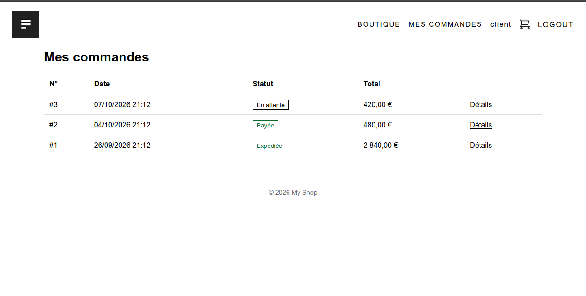
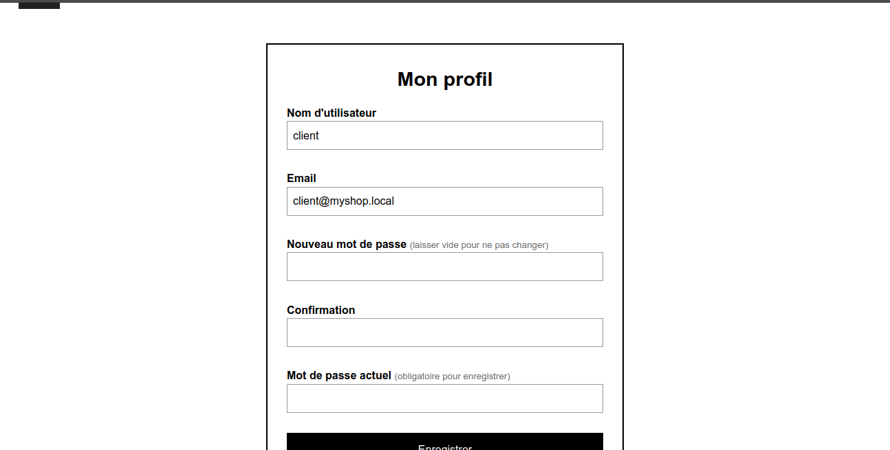
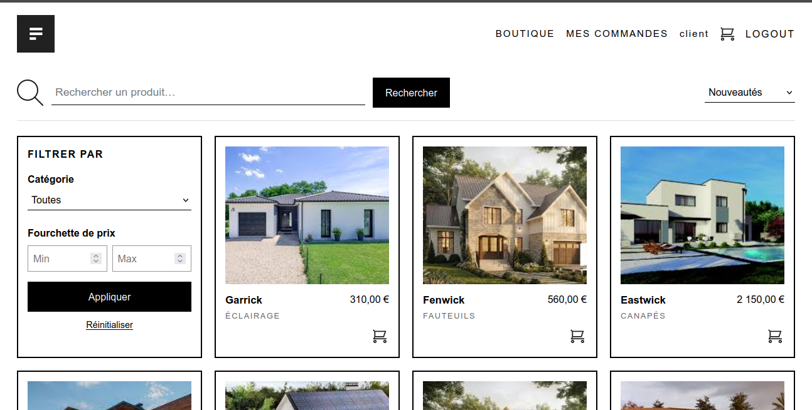
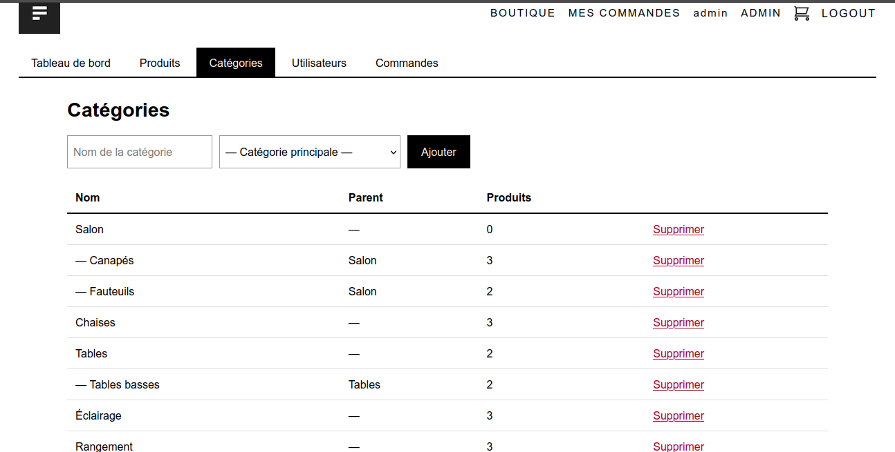
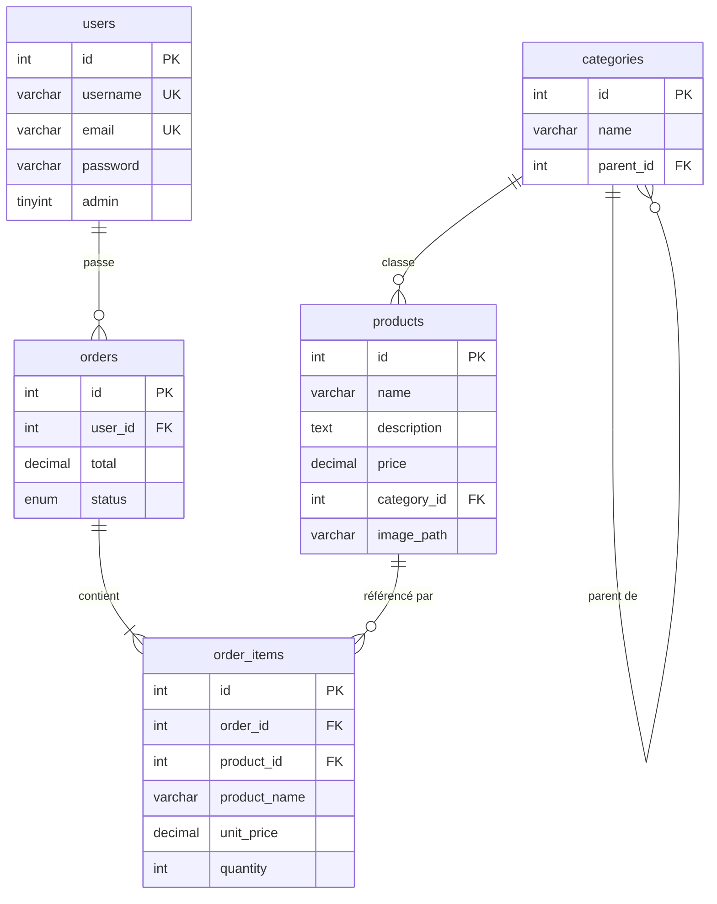

# 🛋️ My Shop

> Application e-commerce complète développée en **PHP natif** (sans framework) selon une architecture **MVC** maison, avec un back-office d'administration et une attention particulière portée à la **sécurité**.







---

## 📌 Sommaire

- [🛋️ My Shop](#️-my-shop)
  - [📌 Sommaire](#-sommaire)
  - [Présentation](#présentation)
  - [Fonctionnalités](#fonctionnalités)
    - [Espace client](#espace-client)
    - [Espace administrateur](#espace-administrateur)
  - [Stack technique](#stack-technique)
  - [Architecture](#architecture)
  - [🗄️ Modèle de données](#️-modèle-de-données)
  - [Sécurité](#sécurité)
  - [Installation](#installation)
    - [Prérequis](#prérequis)
    - [1. Récupérer le projet](#1-récupérer-le-projet)
    - [2. Créer la base de données](#2-créer-la-base-de-données)
    - [3. Configurer la connexion](#3-configurer-la-connexion)
    - [4. Lancer l'application](#4-lancer-lapplication)
    - [5. (Optionnel) Créer votre propre administrateur](#5-optionnel-créer-votre-propre-administrateur)
  - [Comptes de démonstration](#comptes-de-démonstration)
  - [Routes](#routes)
  - [Choix techniques](#choix-techniques)
  - [Limites et évolutions](#limites-et-évolutions)
  - [👨‍💻 Auteur](#-auteur)

---

##  Présentation

**My Shop** est une boutique en ligne de mobilier permettant à un visiteur de parcourir un catalogue, de créer un compte, de remplir un panier et de passer commande. Un espace d'administration protégé permet de gérer les produits, les catégories, les utilisateurs et le suivi des commandes.

Le projet a été conçu comme un exercice de fond : **réimplémenter les briques essentielles d'un framework** (routeur, couche d'accès aux données, authentification, protection CSRF, moteur de vues, upload sécurisé) afin de comprendre en profondeur le fonctionnement d'une application web côté serveur, plutôt que de s'appuyer sur une solution toute faite.

---

##  Fonctionnalités

### Espace client
- **Catalogue dynamique** : recherche textuelle, filtre par catégorie (sous-catégories incluses), fourchette de prix, tri (nouveautés, prix, nom) et **pagination** qui conserve les filtres
- **Fiche produit** détaillée
- **Panier** en session : ajout, modification des quantités, suppression
- **Commande** : validation du panier et enregistrement transactionnel, avec **historique** et détail des commandes
- **Compte utilisateur** : inscription, connexion, déconnexion, modification du profil et du mot de passe
- Interface **responsive** avec menu mobile

### Espace administrateur
- **Tableau de bord** : indicateurs clés (produits, catégories, utilisateurs, commandes, chiffre d'affaires)
- **Produits** : création, modification, suppression, upload et remplacement d'image
- **Catégories** : création (avec sous-catégories) et suppression
- **Utilisateurs** : attribution et retrait des droits administrateur
- **Commandes** : consultation du détail et changement de statut (en attente, payée, expédiée, annulée)

---

##  Stack technique

| Couche | Technologie |
|---|---|
| Langage | PHP 8+ (natif, aucun framework) |
| Base de données | MySQL / MariaDB via **PDO** (requêtes préparées) |
| Autoload | Composer, **PSR-4** (`WecodeGuy\ProjetMyShop\`) |
| Front | HTML5, CSS3 (sans framework), JavaScript vanilla |
| Serveur | Apache (`mod_rewrite`) ou serveur intégré de PHP |

---

##  Architecture

Architecture **MVC** avec un point d'entrée unique (*front controller*) et un routeur centralisé.

```
My_Shop/
├── bin/                    # Scripts CLI (création d'un administrateur)
├── config/
│   ├── config.php          # Configuration (variables d'environnement + surcharge locale)
│   └── routes.php          # Déclaration de toutes les routes
├── database/
│   ├── schema.sql          # Schéma seul
│   ├── seed.sql            # Données de démo (sans comptes)
│   └── my_shop_complet.sql # Schéma + données de démo + comptes (import en une fois)
├── public/                 # ⟵ Seul dossier exposé au web
│   ├── index.php           # Front controller
│   ├── router.php          # Routeur pour `php -S`
│   ├── assets/             # CSS, JS, images
│   └── uploads/            # Images produits (exécution de code interdite)
├── src/
│   ├── Core/               # Router, Auth, Csrf, Session, Database, Cart, Uploader, View…
│   ├── Models/             # User, Product, Category, Order
│   ├── Controllers/        # Contrôleurs publics + Admin/
│   └── Views/              # Templates PHP (layout, partials, pages)
├── storage/logs/           # Journaux applicatifs (hors web)
└── vendor/                 # Autoloader Composer
```

**Cycle d'une requête**

```
Navigateur → public/index.php → Router → (vérif. CSRF si POST) → Contrôleur → Modèle (PDO) → Vue → Réponse
```

- **Router** : routes déclarées par méthode HTTP, paramètres dynamiques (`/product/{id}`), 404/405/500 gérés proprement, indépendant du sous-dossier d'installation.
- **Contrôleurs** : orchestrent la validation et la logique ; aucune requête SQL ni HTML généré à la main.
- **Modèles** : seule couche qui parle à la base de données.
- **Vues** : templates avec échappement systématique des sorties.

---

## 🗄️ Modèle de données



Points de conception :
- **Historique de commande figé** : `order_items` conserve le nom et le prix du produit au moment de l'achat, la commande reste exacte même si le produit est modifié ou supprimé.
- **Intégrité référentielle** : clés étrangères avec `ON DELETE SET NULL` / `CASCADE` selon le cas.
- **Catégories hiérarchiques** via auto-jointure (`parent_id`).
- Encodage **utf8mb4** et moteur **InnoDB** (transactions).

---

##  Sécurité

La sécurité a été traitée comme une exigence de conception, pas comme un ajout final.

| Risque | Mesure mise en place |
|---|---|
| Injection SQL | **PDO + requêtes préparées** partout, émulation désactivée |
| XSS | Échappement systématique des sorties (`htmlspecialchars`), **Content-Security-Policy** stricte (aucun script ni style inline) |
| CSRF | Jeton par session vérifié **centralement dans le routeur** pour toute requête POST |
| Stockage des mots de passe | `password_hash` / `password_verify`, rehash automatique, migration transparente des anciens hash SHA-256 |
| Fixation de session | `session_regenerate_id` à la connexion et à la déconnexion ; cookies `HttpOnly`, `SameSite`, `Secure` (HTTPS) |
| Élévation de privilèges | Création de comptes admin **impossible via l'inscription** ; droits relus en base à chaque requête ; un admin ne peut pas modifier ses propres droits |
| Contrôle d'accès | Garde d'accès dans le constructeur de tous les contrôleurs admin ; un client ne peut consulter que **ses** commandes |
| Upload de fichiers | Type vérifié par le **contenu** (`finfo` + `getimagesize`), extension déduite du MIME, nom aléatoire, taille limitée, **exécution de code désactivée** dans `uploads/` |
| Énumération de comptes | Message d'erreur de connexion générique + limitation des tentatives |
| Redirections ouvertes | Seuls les chemins internes sont acceptés (`safe_path`) |
| Manipulation de prix | Les prix du panier sont **toujours relus en base** au moment de la commande |
| Exposition de fichiers | `src/`, `config/`, `vendor/`, `storage/` inaccessibles ; seul `public/` est servi |
| Fuite d'informations | Erreurs détaillées uniquement en mode `dev`, toujours journalisées dans `storage/logs/` |
| Autres | En-têtes `X-Content-Type-Options`, `X-Frame-Options`, `Referrer-Policy` ; identifiants BDD hors du dépôt |

---

##  Installation

### Prérequis
- PHP **8.0+** avec les extensions `pdo_mysql` et `fileinfo`
- MySQL ou MariaDB
- Apache avec `mod_rewrite` (ou simplement le serveur intégré de PHP)

### 1. Récupérer le projet
```bash
git clone <url-du-depot> My_Shop
cd My_Shop
```

### 2. Créer la base de données
Dans phpMyAdmin (ou en ligne de commande), créez une base `my_shop` en `utf8mb4_unicode_ci`, puis importez **`database/my_shop_complet.sql`** (schéma + produits de démonstration + comptes de test).

```bash
mysql -u root -p -e "CREATE DATABASE my_shop CHARACTER SET utf8mb4 COLLATE utf8mb4_unicode_ci"
mysql -u root -p my_shop < database/my_shop_complet.sql
```

### 3. Configurer la connexion
```bash
cp config/config.local.example.php config/config.local.php
```
Renseignez ensuite vos identifiants dans `config/config.local.php` (fichier ignoré par Git). Les variables d'environnement `DB_HOST`, `DB_NAME`, `DB_USER`, `DB_PASS` et `APP_ENV` sont également prises en charge.

### 4. Lancer l'application

**Option A : serveur intégré de PHP**
```bash
php -S localhost:8000 -t public public/router.php
```
Puis ouvrez <http://localhost:8000>.

**Option B : Apache / XAMPP / WAMP**
Placez le projet dans `htdocs/` et ouvrez <http://localhost/My_Shop/>. En production, pointez le *DocumentRoot* directement sur `public/` et définissez `APP_ENV=prod`.

### 5. (Optionnel) Créer votre propre administrateur
```bash
php bin/create_admin.php monadmin moi@exemple.com
```

---

##  Comptes de démonstration

Fournis par `my_shop_complet.sql` :

| Rôle | Identifiant | Mot de passe |
|---|---|---|
| Administrateur | `admin` | `Admin12345` |
| Client | `client` | `Client12345` |

> ⚠️ Comptes destinés au développement uniquement : à supprimer ou à modifier avant toute mise en ligne. Leurs mots de passe sont convertis en hash moderne à la première connexion.

---

##  Routes

| Méthode | URL | Description | Accès |
|---|---|---|---|
| GET | `/` | Catalogue (recherche, filtres, tri, pagination) | Public |
| GET | `/product/{id}` | Fiche produit | Public |
| GET/POST | `/signin`, `/signup` | Connexion, inscription | Public |
| POST | `/logout` | Déconnexion | Connecté |
| GET/POST | `/profile` | Profil et mot de passe | Connecté |
| GET | `/cart` | Panier | Public |
| POST | `/cart/add`, `/cart/update`, `/cart/remove` | Gestion du panier | Public |
| GET/POST | `/checkout` | Validation de la commande | Connecté |
| GET | `/orders`, `/orders/{id}` | Historique et détail | Connecté |
| GET | `/admin` | Tableau de bord | Admin |
| GET/POST | `/admin/products…` | CRUD produits (création, édition, suppression) | Admin |
| GET/POST | `/admin/categories…` | Gestion des catégories | Admin |
| GET/POST | `/admin/users…` | Gestion des droits | Admin |
| GET/POST | `/admin/orders…` | Suivi et statut des commandes | Admin |

---

##  Choix techniques

- **Pas de framework, par choix pédagogique** : le but est de maîtriser ce qu'un framework fait « sous le capot » (routage, middleware, ORM léger, sessions, CSRF).
- **Front controller + `public/` seul exposé** : réduit drastiquement la surface d'attaque par rapport à une arborescence où tout est accessible.
- **CSRF centralisé dans le routeur** : impossible d'oublier la protection sur un nouveau formulaire POST.
- **Séparation stricte des responsabilités** : les modèles ne produisent ni HTML ni redirections ; les contrôleurs ne contiennent pas de SQL.
- **Transactions** pour la création de commande : une commande et ses lignes sont enregistrées de façon atomique.
- **Post/Redirect/Get** après chaque action d'écriture pour éviter les doubles soumissions.
- **Configuration externalisée** : aucun secret dans le dépôt.

---

##  Limites et évolutions

Pistes identifiées pour la suite :

- [ ] Intégration d'un **paiement en ligne** (Stripe / Mobile Money) : les commandes sont actuellement enregistrées avec le statut « En attente »
- [ ] Gestion des **stocks** et des variantes (couleurs, dimensions)
- [ ] **Emails transactionnels** (confirmation de commande, réinitialisation de mot de passe)
- [ ] Limitation des tentatives de connexion **par IP / compte** (actuellement basée sur la session)
- [ ] **Tests automatisés** (PHPUnit) et intégration continue
- [ ] Éditeur de **sous-catégories** plus poussé et gestion de plusieurs images par produit
- [ ] Internationalisation et multi-devises

---

## 👨‍💻 Auteur

**SORO DONASSIGUE MATHIEU**, développeur web
✉️ sorodonassigue491@gmail.com

*Projet réalisé dans le cadre de ma formation à Epitech.*